<div align="center">


<br><br>


<br>

<a href="https://github.com/adarsh3435546">

</a>


<br><br>


</div>


## 🧭 About Me


I'm a Computer Science & Engineering student who builds backend systems that actually hold up in production. I care about **clean architecture, secure APIs, and code that still makes sense six months later.**

```java
public class Adarsh {
    private String[] stack = {"Java", "Spring Boot", "PostgreSQL", "React"};
    private String mission = "What if I build this? → It's actually working.";

    public void currentFocus() {
        System.out.println("Spring Security, JPA/Hibernate, System Design, DSA");
    }
}
```

- 🔭 Currently building full-stack apps with **Spring Boot + React**
- 🌱 Deepening skills in **Spring Security, JWT, and database design**
- 🧠 Practicing **DSA** — patterns over memorization
- 💬 Ask me about **REST APIs, PostgreSQL, backend architecture**
- ⚡ Fun fact: went from parsing multi-GB network logs as an intern to shipping full-stack apps with role-based auth

<br clear="right"/>


## 💼 Experience


### Software Developer Intern — Alcatel-Lucent Enterprise

<br>

Worked on tooling for large-scale network data analysis — built a **FastAPI-based platform** to ingest, parse, filter, and visualize AOS switch logs and HMON datasets across **multi-GB** files, with automation workflows to speed up log analysis.

<p>


</p>


## 🛠️ Tech Arsenal

<div align="center">

### Languages


### Backend & Database


### Frontend


### Tools


<br>


</div>


## 🚀 Featured Projects


### 💰 Finance Tracker

<br>

Full-stack personal finance management app with layered backend architecture.

| Layer | Details |
|---|---|
| **Backend** | Spring Boot · Spring Security · JWT Auth · JPA/Hibernate |
| **Database** | PostgreSQL |
| **Features** | 🔐 Auth · 💳 Transactions · 📊 Dashboard · 💰 Budgets · 🏷️ Categories · 🛡️ Role-based access |

<br>


### 🍬 Kasthuri Sweets

<br>

Full-stack e-commerce app with real payment integration.

| Layer | Details |
|---|---|
| **Stack** | Spring Boot · PostgreSQL · React · Vite · Razorpay |
| **Features** | 🛒 Product management · 👤 Auth · 💳 Razorpay payments · 📦 Orders · 🔗 REST APIs |

<br>


### 🚗 Vehicle Rental Platform

<br>

Backend-focused rental management system built around real-world rental workflows.

| Layer | Details |
|---|---|
| **Focus** | REST APIs · Database Design · Backend Architecture · Java |


## 🧠 Problem Solving

<div align="center">

Practicing DSA with an emphasis on recognizing patterns over memorizing solutions:

    
<br>
   
<br>
   

<br><br>

<a href="https://leetcode.com/">

</a>

<br><br>


</div>


## 📊 GitHub Analytics

<div align="center">


<br>


<br><br>


<br><br>


</div>


## 🎯 Roadmap

```mermaid
graph LR
    A[☕ Java] --> B[🌱 Spring Boot]
    B --> C[🔐 Spring Security]
    C --> D[🗄️ JPA / Hibernate]
    D --> E[🐘 PostgreSQL]
    E --> F[🔗 REST APIs]
    F --> G[🏗️ System Design]
    G --> H[⚡ Scalable Backend Systems]

    style A fill:#f89820,stroke:#333,color:#fff
    style B fill:#6DB33F,stroke:#333,color:#fff
    style C fill:#6DB33F,stroke:#333,color:#fff
    style D fill:#59666C,stroke:#333,color:#fff
    style E fill:#336791,stroke:#333,color:#fff
    style F fill:#02569B,stroke:#333,color:#fff
    style G fill:#36BCF7,stroke:#333,color:#fff
    style H fill:#0A66C2,stroke:#333,color:#fff
```



My goal: become a backend engineer who doesn't just write code that runs — but designs systems that are reliable, secure, and maintainable at scale.


## 📚 Currently Learning

<div align="center">

🌱 Advanced Spring Boot &nbsp;|&nbsp; 🔐 Spring Security &nbsp;|&nbsp; 🗄️ Advanced SQL & DBMS &nbsp;|&nbsp; 🧠 DSA &nbsp;|&nbsp; 🏗️ Backend Architecture &nbsp;|&nbsp; ☁️ Cloud & Deployment

</div>


## 🤝 Let's Connect

<div align="center">

<a href="https://github.com/adarsh3435546">

</a>
<a href="https://www.linkedin.com/">

</a>

<br><br>


<br>

<i>Code → Learn → Build → Repeat 🔥</i>

</div>


