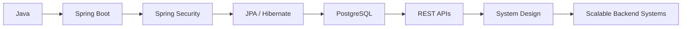

<div align="center">


<a href="https://github.com/adarsh3435546">

</a>
<a href="https://leetcode.com/">

</a>


</div>

<br>

## 🧭 About Me

I'm a Computer Science & Engineering student who builds backend systems for a living (well — almost). I care about **clean architecture, secure APIs, and code that still makes sense six months later.**

```java
public class Adarsh {
    private String[] stack = {"Java", "Spring Boot", "PostgreSQL", "React"};
    private String mission = "What if I build this? → It's actually working.";

    public void currentFocus() {
        System.out.println("Spring Security, JPA/Hibernate, System Design, DSA");
    }
}
```

- 🔭 Currently building full-stack apps with **Spring Boot + React**
- 🌱 Deepening skills in **Spring Security, JWT, and database design**
- 🧠 Practicing **DSA** with a focus on patterns, not memorization
- 💬 Ask me about **REST APIs, PostgreSQL, or backend architecture**
- ⚡ Fun fact: I've gone from a FastAPI intern parsing multi-GB network logs to architecting full-stack apps with role-based auth

---

## 💼 Experience

<table>
<tr>
<td width="120" align="center">🏢</td>
<td>

**Software Developer Intern** — Alcatel-Lucent Enterprise

Worked on tooling for large-scale network data analysis — built a **FastAPI-based platform** to ingest, parse, filter, and visualize AOS switch logs and HMON datasets across **multi-GB** files, with automation workflows to speed up log analysis.

`Python` `FastAPI` `Data Processing` `REST APIs`

</td>
</tr>
</table>

---

## 🛠️ Tech Stack

<table>
<tr>
<td valign="top" width="33%">

**Languages**
<p>

</p>

</td>
<td valign="top" width="33%">

**Backend**
<p>

</p>

</td>
<td valign="top" width="33%">

**Database**
<p>

</p>

</td>
</tr>
<tr>
<td valign="top">

**Frontend**
<p>

</p>

</td>
<td valign="top">

**Tools**
<p>

</p>

</td>
<td valign="top">

**Core Focus**
<p>
<br/>
<br/>

</p>

</td>
</tr>
</table>

---

## 🚀 Featured Projects

### 💰 Finance Tracker
Full-stack personal finance management app with layered backend architecture.

| Layer | Details |
|---|---|
| **Backend** | Spring Boot, Spring Security, JWT Auth, JPA/Hibernate |
| **Database** | PostgreSQL |
| **Features** | 🔐 Auth · 💳 Transactions · 📊 Dashboard · 💰 Budgets · 🏷️ Categories · 🛡️ Role-based access |

---

### 🍬 Kasthuri Sweets
Full-stack e-commerce app with real payment integration.

| Layer | Details |
|---|---|
| **Stack** | Spring Boot, PostgreSQL, React, Vite, Razorpay |
| **Features** | 🛒 Product management · 👤 Auth · 💳 Razorpay payments · 📦 Orders · 🔗 REST APIs |

---

### 🚗 Vehicle Rental Platform
Backend-focused rental management system built around real-world rental workflows.

| Layer | Details |
|---|---|
| **Focus** | REST APIs · Database Design · Backend Architecture · Java |

---

## 🧠 Problem Solving

Practicing DSA with an emphasis on recognizing patterns over memorizing solutions:

`Arrays` `Strings` `Hashing` `Two Pointers` `Sliding Window` `Binary Search` `Prefix Sum` `Stack` `Queue` `Linked List` `Trees` `Graphs` `Dynamic Programming`

<div align="center">
<a href="https://leetcode.com/">

</a>
</div>

---

## 📊 GitHub Stats

<div align="center">


</div>

---

## 🐍 Contribution Journey

<div align="center">

</div>

---

## 🎯 Roadmap



My goal: become a backend engineer who doesn't just write code that runs — but designs systems that are reliable, secure, and maintainable at scale.

---

## 📚 Currently Learning

🌱 Advanced Spring Boot · 🔐 Spring Security · 🗄️ Advanced SQL & DBMS · 🧠 DSA · 🏗️ Backend Architecture · ☁️ Cloud & Deployment

---

## 🤝 Let's Connect

<div align="center">

<a href="https://github.com/adarsh3435546">

</a>
<a href="https://www.linkedin.com/">

</a>

</div>

<br>


<div align="center"><i>Code → Learn → Build → Repeat 🔥</i></div>
